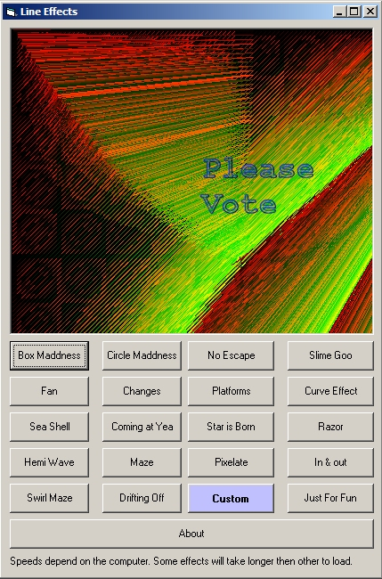



## Line FXz \(Very Very Cool\) No Cheap Graphics

### Description

This is a real cool update to one of my line effect programs. Just small fractal iamges in the screen. Each are really amazing to watch. Each take about 30 seconds to complete. Please Vote or Comment. :)
 
### More Info
 
Hmm how did he do that :)

Sorta Slow at times :( i can tell no lie

             |
---                |---
**Submitted On**   |2002-02-18 15:05:40
**By**             |[Josh Nixon](https://github.com/Planet-Source-Code/PSCIndex/blob/master/ByAuthor/josh-nixon.md)
**Level**          |Advanced
**User Rating**    |4.4 (44 globes from 10 users)
**Compatibility**  |VB 3\.0, VB 4\.0 \(16\-bit\), VB 4\.0 \(32\-bit\), VB 5\.0, VB 6\.0
**Category**       |[Graphics](https://github.com/Planet-Source-Code/PSCIndex/blob/master/ByCategory/graphics__1-46.md)
**World**          |[Visual Basic](https://github.com/Planet-Source-Code/PSCIndex/blob/master/ByWorld/visual-basic.md)
**Archive File**   |[Line\_FXz\_\(89235622002\.zip](https://github.com/Planet-Source-Code/josh-nixon-line-fxz-very-very-cool-no-cheap-graphics__1-35387/archive/master.zip)

### API Declarations

YME (Yar Math Engine) Bootleg haha

